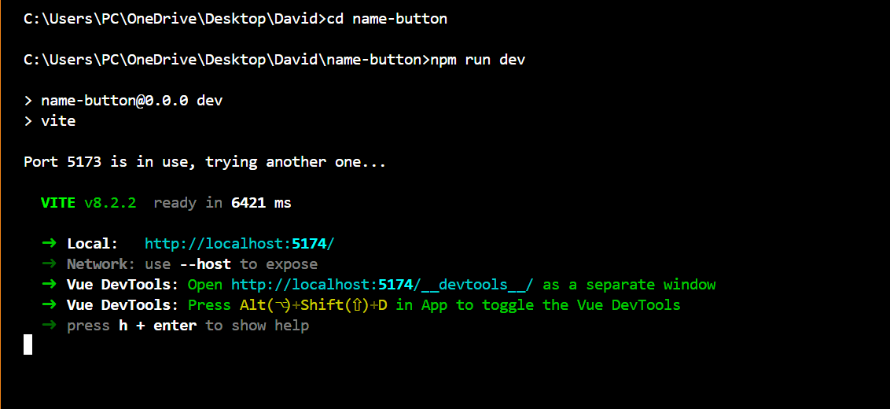
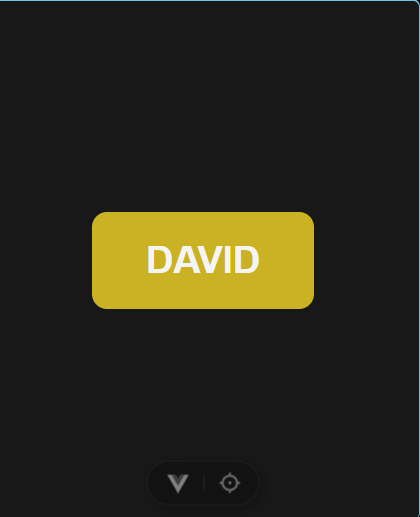
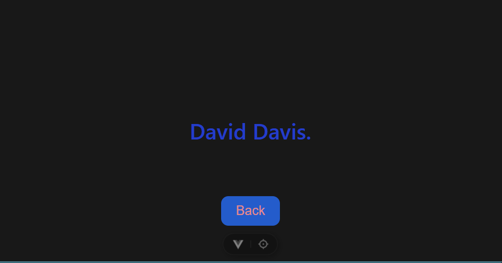

# What I built
 A Button tha displays my name that  when clicked it shakes and take you to another page.

# what I did:   
1. Created a vue project.
2. Built a centered button
3. Installed dependencies
4. Added a click animation to make it shake.

## Project Setup
 ```sh
 # Vue Installation
 npm create vue@latest
 cd name-button
 npm install
 npm run dev
 ```
# Terminal Output
 

## The HMTL Section:
```sh
 <template>
   <button class="name-button" :class=" {shake: isShaking}" @click = "shakeButton">
   DAVID</button>
  </template>
```

## The CSS:
```sh
<style scoped>
  .name-button {
    padding: 18px 36px;
    border: none;
    cursor: pointer;
    color: whitesmoke;
    border-radius: 10px;
    background-color: rgb(203, 178, 36);
    font-size: 25px;
    font-weight: 600;
  }
  .name-button.shake {
    animation: shake 0.5s ease-in-out;
  }
  .name-button:hover {
    background-color: black;
    color: rgb(203, 136, 36);
    box-shadow: 0px 0px 10px rgb(235, 206, 44);
  }
  @keyframes shake {
    0% { transform: translate(1px, 1px); }
    20% { transform: translate(-1px); }
    40% { transform: translate(1px, -1px); }
    60% { transform: translate(-1px, 1px); }
    80% { transform: translate(1px, 6px); }
    100% { transform: translate(0, 0); }
  }  
</style>
```

## The Script:
```sh
<script setup>
  import { ref } from 'vue'
  const isShaking = ref(false)

  function shakeButton() {
    isShaking.value =  false 
    requestAnimationFrame(() => {
      isShaking.value = true
    })
  }
</script>
```
### Installed Dependencies
```sh
"dependencies": {
    "vue": "^3.5.40"
  }
  "devDependencies": {
    "@vitejs/plugin-vue": "^6.0.8",
    "vite": "^8.1.5",
    "vite-plugin-vue-devtools": "^8.1.5"
  }
```

#### The Animation
``` sh
 @keyframes shake {
    0% { transform: translate(1px, 1px); }
    20% { transform: translate(-1px); }
    40% { transform: translate(1px, -1px); }
    60% { transform: translate(-1px, 1px); }
    80% { transform: translate(1px, 6px); }
    100% { transform: translate(0, 0); }
  }  
```
# The First Page.
 

![Screenshot] (./screenshot/organized.png)

## The New Page Creation
```sh
 <template>
  <div class="newpage">
    David Davis.
  </div>
  <router-link to="/">
    <button class="back" 
    @click="$emit('go-back')">
      Back
    </button>
  </router-link>
</template>

<style scoped>
.newpage {
  min-height: 100vh;
  display: grid;
  place-items: center;
  font-size: 30px;
  font-weight: 600;
  color: rgb(36, 61, 203);
  text-align: center;
}
.back {
  position: absolute;
  padding: 10px 20px;
  bottom: 50px; 
  border: none;
  cursor: pointer;
  color: rgb(230, 139, 139);
  border-radius: 10px;
  background-color: rgb(36, 92, 203);
  font-size: 18px;
}
</style>

<script setup>
  defineEmits(['go-back'])
</script>
```
# The Second Page;
   

# Git Commands:
1. Initialization of local repo:
 ```sh
  cd your-project-folder
  git init
```
2.Configuration of your identity
```sh
   git config --global user.name "Your Name"
   git config --global user.email "you@example.com"
```
3. Adding and Commiting Files
```sh
  git add .
  git commit -m  "Initial commit"
```
4. Linked local repo to the remote and Branch renaming and Code Pushing
```sh 
 git remote add origin https://github.com/username/repo-name.git
 git branch -M main
 git push -u origin main
```
5. For Updating Code to Git
```sh
git add .
git commit -m "Describe your change"
git push
```
